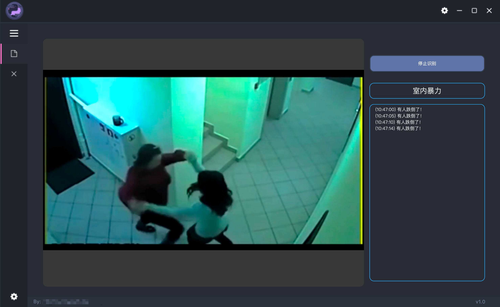

# Public-Place-Monitoring-System

## How Tu Run
1. Create a conda Env:
```
conda create -n PPMS python=3.11 --yes
```
2. Active the environment.
```
conda activate PPMS
```
3. Install the requirements
```
pip install -r requirements.txt
```
4. Open the APP
```
python main.py
```

